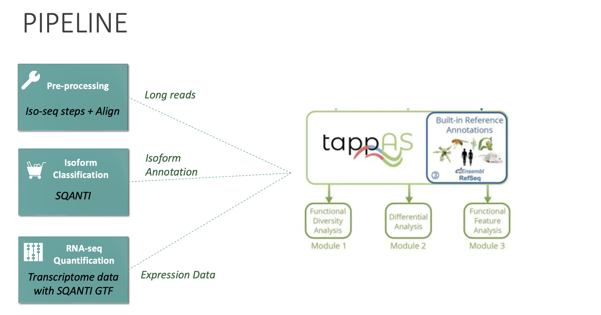

# Pacbio long reads BulkRNA seq analysis:
This repo contains the scripts used for analysis of pacbio long read sequencing to detect the isoforms

## PIPELINE FLOWCHART:


## STEPS:
- Part 1 : PacBio step to generate high quality transcript fastq 
** Script used : iso-seq_script.sh **
    - Pre-processing steps
        - iso-seq refine     : PolyA tail trimming and concatemer removal 
        - iso-seq cluster    : Cluster full-length non-concatemer reads and generate polished transcripts
    - Alignment 
        - pbmm2 align        : Alignment of the fastq with reference genome
        - samtool stats      : Alignment stats
    - Collapse
        - iso-seq collapse   : Collapse all the redundant transcripts
    

- Part 2: Bulk RNA-seq short reads quantification using the high-quality transcript fasta file produced
** Script used : RNA-seq_quantification.sh **
    - Building index:
        - Kallisto index     : Building index from the fasta file produced by part 1
    - Alignment
        - Kallisto quant     : Quantification of raw bulk-RNA short reads 
    - Abundance 
        - Kallisto abundance : Combine all the samples quant file

- Part 3: SQANTI for isoform classification
** Script used : SQANTI.sh **
    - Isoform Classification:
        - sqanti3_qc.py : isoform classification

- Part 4: tappAS for visualization
    - Download the raw tappAS.jar file from https://app.tappas.org/
    - Java installation for Mac using command line
   ```
   wget https://javadl.oracle.com/webapps/download/GetFile/1.8.0_251-b08/3d5a2bb8f8d4428bbe94aed7ec7ae784/unix-i586/jre-8u251-macosx-x64.tar.gz
   tar xvf jre-8u251-macosx-x64.tar.gz
   ```

    - Launch the application
    ```
    ./jre1.8.0_251.jre/Contents/Home/bin/java -jar tappas.jar
    ```

    NOTE: Path to Rscript when prompted by tappas:
          ```
          /usr/local/bin/Rscript
          ```
    
    - Running tapppAS:
        - Select new project    : <Name>
        - Select species        : <Species of interest>
        - Annotation features   : File from IsoAnnolite.py gff 
        - Experiment type       : Two group comparison
        - Design File           : tsv file with sample information. 
            - Make sure that the control samples are mentioned first.
        - Matrix File           : tsv file from kallisto_abundance. 
            - The sample names should match with samples in design file. 
            - The header should start with first sample name (no column name for transcript is needed)
            - The transcript name should match the names in gff
        - Run with default settings  


## CONDA ENVIRONMENT:
- Create a new conda environment and installing tools needed for long reads sequencing analysis 
```
conda create -f conda_env/long-read-seq.yml
conda activate long-read-seq
```


